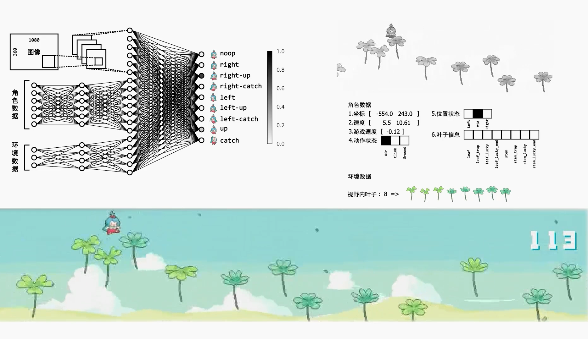

# 用PPO算法玩B站风叶穿行游戏



## 程序说明

本程序基于windows系统，python3.7.9，pytorch1.7.1

## 准备本地游戏环境

感谢bczhc同学的风叶穿行离线版实现，请[下载](https://github.com/bczhc/bczhc.github.io/archive/refs/heads/master.zip)其仓库并将zip文件放置于offline_game文件夹

运行以下代码构造离线版环境：

```
python wenv/prepare_offline_env.py
```

如果想自己玩一下，可以输入：

```
 python test_play_offline_by_human.py
```


## 开始训练

输入

```
python train.py
```

详细参数

```
usage: train.py [-h] [--seed SEED] [--weight_path WEIGHT_PATH]
                [--summary_path SUMMARY_PATH] [--num_env NUM_ENV]
                [--monitor MONITOR] [--lr LR] [--eps EPS]
                [--test_step TEST_STEP] [--test_round TEST_ROUND]
                [--max_train_episode MAX_TRAIN_EPISODE]
                [--num_collection_steps NUM_COLLECTION_STEPS] [--gamma GAMMA]
                [--gae_lambda GAE_LAMBDA] [--train_epoch TRAIN_EPOCH]
                [--batch_split BATCH_SPLIT] [--epsilon EPSILON] [--beta BETA]
                [--mode_save_episode MODE_SAVE_EPISODE]
                [--log_path_training LOG_PATH_TRAINING]
                [--log_path_testing LOG_PATH_TESTING]

optional arguments:
  -h, --help            show this help message and exit
  --seed SEED           随机数种子（虽然没什么用，程序无法控制javascript内部随机数）
  --weight_path WEIGHT_PATH
                        权重保存路径
  --summary_path SUMMARY_PATH
                        log文件保存路径
  --num_env NUM_ENV     同时训练的环境数
  --monitor MONITOR     可视化环境显示的显示屏位置
  --lr LR
  --eps EPS
  --test_step TEST_STEP
                        训练中测试的间隔
  --test_round TEST_ROUND
                        每次测试的次数
  --max_train_episode MAX_TRAIN_EPISODE
                        最大训练轮次
  --num_collection_steps NUM_COLLECTION_STEPS
                        每episode收集数据步数
  --gamma GAMMA         奖励折扣因子
  --gae_lambda GAE_LAMBDA
                        gae参数
  --train_epoch TRAIN_EPOCH
                        每episode数据的训练轮数
  --batch_split BATCH_SPLIT
                        每epoch训练时切分数
  --epsilon EPSILON
  --beta BETA           计算actor loss时熵的系数
  --mode_save_episode MODE_SAVE_EPISODE
                        训练模型保存间隔
  --log_path_training LOG_PATH_TRAINING
  --log_path_testing LOG_PATH_TESTING

```


## 在线AI

（如果B站首页小游戏还是风叶穿行的话）

首次运行请在控制台输入如下指令生成证书文件：

```
mitmproxy
```

转到 C:\Users\你的用户名\\.mitmproxy 文件夹，双击mitmproxy-ca-cert.p12，全部选择默认选项，安装证书。

之后，请在仓库根目录下打开控制台，输入指令：

```
mitmdump -s httpproxy.py -p 9090
```

之后，请准备好训练好的环境pth文件与模型形状文件，调用

```
from test import GameTest
GameTest(mode=Game.ONLINE, goal=180,
             weight_shape_path=r"<模型形状文件路径>.json",
             weight_actor_path="<actor模型的pth文件路径>.pth")

```

即可进行在线测试（前提是B站还把风叶穿行小游戏放在首页）
